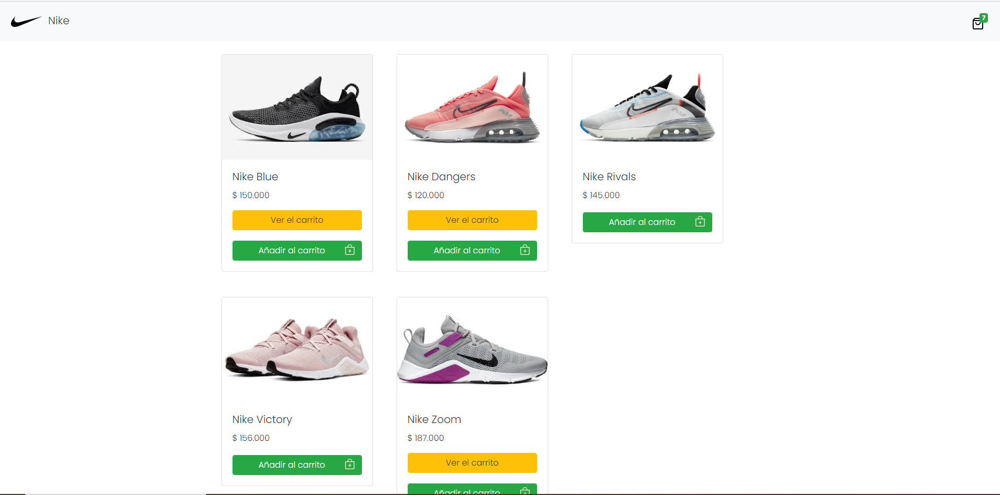
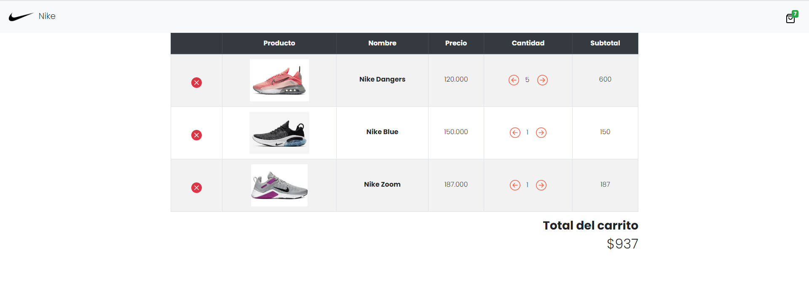

# Tienda Online con puro PHP
Quería saber si era posible diseñar una tienda online sin utilizar librerías ni framework y el resultado fue el siguiente.

## Vista previa de los productos

## Carrito

